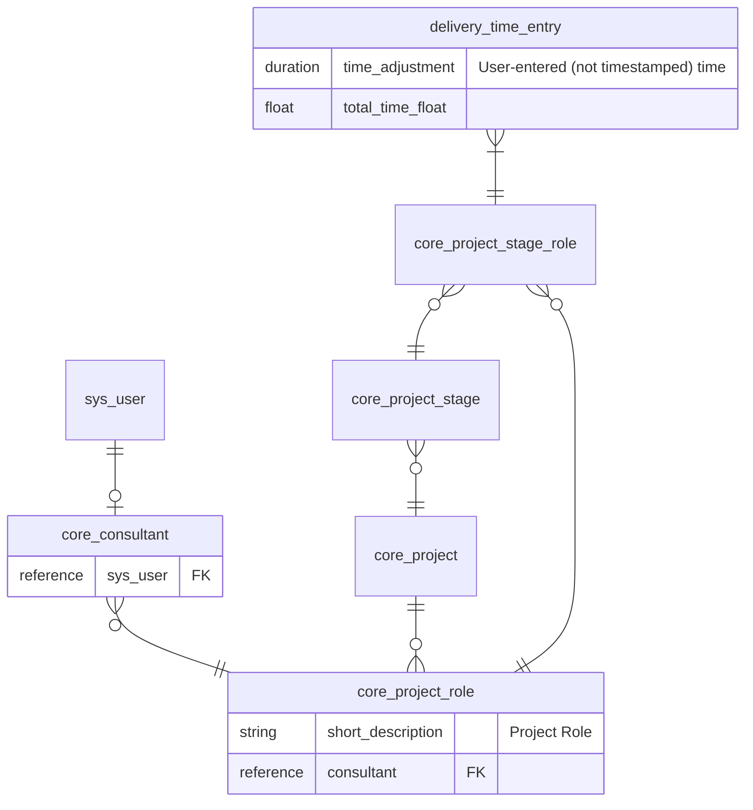

# Timesheet App

### Description 
*A UI Builder component and subcomponents for tracking time related to esolutionsONE projects*

## Dev Screenshots

## Stuff we learned
- When setting dates in business rules, use .getDisplayValue() instead of .getValue(). On the server side, SN will adjust any times sent or received to a user who has a specified time zone, so when inputting dates, .getDisplayValue() will correspond to the correct UTC time.

- Deleting an existing custom component:
    - Need to nevigate to sys_app.list and locate the scope that the component currently exists in.
    - Manually delete records that are associated to component (It seems as though the amount of records varies depending on how many things are in now-ui.json)
    - Tip to find all of the records, redeploy component with --force and head to sys_app.list, open scope, and sort by recently updated records. All records associated with component should
    be at the top. 

## Errors
- Cannot create property 'elm' on boolean 'false' at createElm
    - While we can use short circuits in jsx, we can't use them to wipe out an entire element. Instead, use a ternary (I guess so there's something to replace it with on the VDOM, even if it's just a string?)

## Architectural Q's

- Will the project_role and project_stage 'active' statuses be updated and in sync? Do we need to check project.state as well?
- What's the road to deployment? Apparently, components within an AES app don't get promoted along with the app
- We'll need to try to promote again, fixing the name in the package.json as well

## User Access Requirements

- Roles
    - x_esg_one_delivery.user (or .admin)
    - x_esg_one_core.user (or .admin)
- A consultant record linked to user's sys_user (else will stick on loading)
- At least one valid Project Stage Role with appropriate relations (since projects, etc. are assigned, not chosen by the user - else won't render any projects to track time on, obviously)

## ERD

